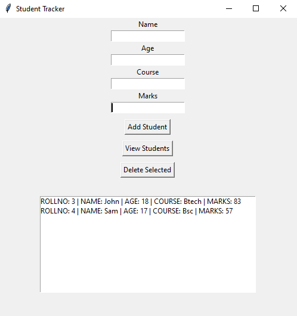

🧑‍🎓 Student Tracker – Python + MySQL + Tkinter
A lightweight desktop app to manage student records using Python, MySQL, and Tkinter GUI.
Easily add, view, and delete students — all from a simple interface!

💡 Features
📥 Add student details (Name, Age, Course, Marks)

👁️ View student records in a list

🗑️ Delete selected student

🔄 Real-time update with database

✅ Clean, beginner-friendly UI

🛠️ Tech Stack
Python 3.x

Tkinter for GUI

MySQL for database

mysql-connector-python for connection

⚙️ How to Run the Project
1. Clone this repository
git clone https://github.com/your-username/student-tracker.git
cd student-tracker

2. Install dependencies
pip install mysql-connector-python

3. Set up MySQL database
CREATE DATABASE STUDENTS;

USE STUDENTS;

CREATE TABLE STUDENTS (
    ROLLNO INT PRIMARY KEY AUTO_INCREMENT,
    NAME VARCHAR(100),
    AGE INT,
    COURSE VARCHAR(100),
    MARKS INT
);

4. Run the app
python student_gui.py

🙌 Contribute
Want to improve this app or add features? Fork this repo and submit a pull request!

📩 Feedback
Found a bug? Got an idea? Open an issue or message me on GitHub!

📌 License
This project is open-source and free to use. No limits — just give credit if you share!